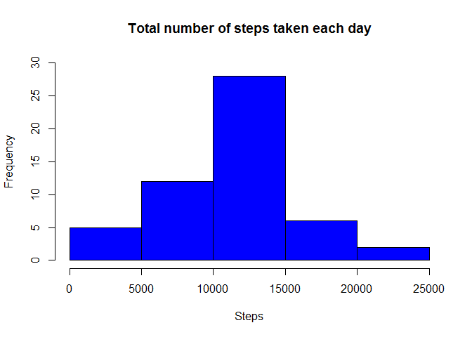
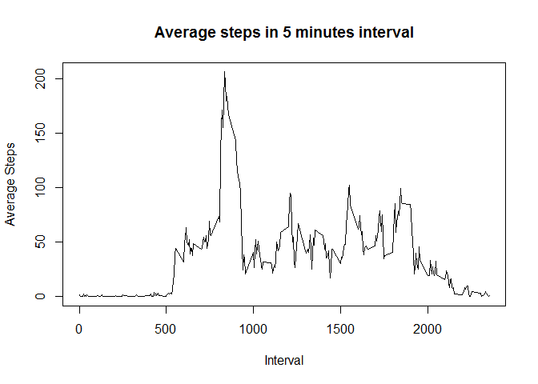
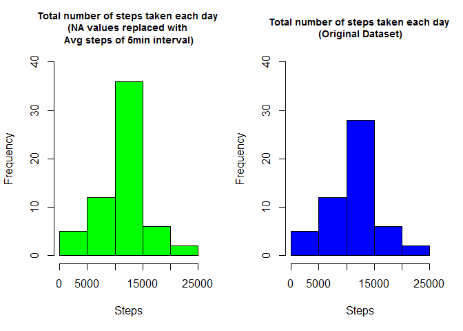
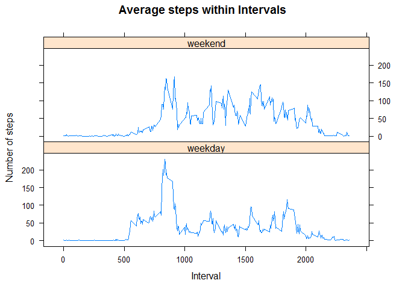

# Reproducible Research: Peer Assessment 1
Load the required packages for the entire assessment and set the global option
with echo equals to TRUE so that code is visible to any anyone reading this markdown file


```r
library(dplyr)
library(chron)   #Used for is.weekend() function
library(lattice)
library(knitr)
opts_chunk$set(echo = TRUE)
```

## Loading and preprocessing the data

1.Load the data (i.e. read.csv())


```r
setwd("C:/Working/Coursera/Repro_research/RepData_PeerAssessment1")

if(!file.exists('activity.csv')){
  unzip('activity.zip')
}
data <- read.csv('activity.csv', header = TRUE, sep = ",")
```

2.Process/transform the data (if necessary) into a format suitable for your analysis


```r
data$date <- as.Date(data$date, format = "%Y-%m-%d")
```

## What is mean total number of steps taken per day?

For this part let us ignore the missing values in the dataset.

1. Calculate the total number of steps taken per day


```r
stepsbydate <- summarise(group_by(na.omit(data), date), totalsteps = sum(steps))

head(stepsbydate)
```

```
## # A tibble: 6 × 2
##         date totalsteps
##       <date>      <int>
## 1 2012-10-02        126
## 2 2012-10-03      11352
## 3 2012-10-04      12116
## 4 2012-10-05      13294
## 5 2012-10-06      15420
## 6 2012-10-07      11015
```

2. Make a histogram of the total number of steps taken each day


```r
hist(stepsbydate$totalsteps, col = "blue", xlab = "Steps", ylim = c(0,30),
     main = "Total number of steps taken each day" )
```

<!-- -->


3.Calculate and report the mean and median of the total number of steps taken per day


```r
meanval <- mean(stepsbydate$totalsteps)

meanval
```

```
## [1] 10766.19
```


```r
medianval <- median(stepsbydate$totalsteps)

medianval
```

```
## [1] 10765
```


## What is the average daily activity pattern?

1.Make a time series plot (i.e. type = "l") of the 5-minute interval (x-axis) and the average number of steps taken, averaged across all days (y-axis)


```r
#calculate the average number of steps for each interval
stepsbyinterval <- summarise(group_by(data, interval), avgsteps = mean(steps, na.rm = TRUE))

#plot the line graph
plot(stepsbyinterval$interval, stepsbyinterval$avgsteps, type = "l",
     xlab = "Interval", ylab = "Average Steps", 
     main = "Average steps in 5 minutes interval")
```

<!-- -->

2. Which 5-minute interval, on average across all the days in the dataset, contains the maximum number of steps?


```r
filter(stepsbyinterval, avgsteps == max(avgsteps))
```

```
## # A tibble: 1 × 2
##   interval avgsteps
##      <int>    <dbl>
## 1      835 206.1698
```


## Imputing missing values

There are a number of days/intervals where there are missing values (coded as NA). The presence of missing days may introduce bias into some calculations or summaries of the data


1. Calculate and report the total number of missing values in the dataset (i.e. the total number of rows with NAs)


```r
sum(is.na(data$steps))
```

```
## [1] 2304
```

2. Devise a strategy for filling in all of the missing values in the dataset. The strategy does not need to be sophisticated. For example, you could use the mean/median for that day, or the mean for that 5-minute interval, etc.


```r
#reuse the dataset stepsbyinterval (hold average steps for 5mins interval) and merge it with original data set
newdata <- merge(data, stepsbyinterval, by="interval")

#Replace the NA values with the mean for that 5mins interval
newdata$steps <- ifelse(is.na(newdata$steps), newdata$avgsteps, newdata$steps)

#verify the dataset
head(newdata)
```

```
##   interval    steps       date avgsteps
## 1        0 1.716981 2012-10-01 1.716981
## 2        0 0.000000 2012-11-23 1.716981
## 3        0 0.000000 2012-10-28 1.716981
## 4        0 0.000000 2012-11-06 1.716981
## 5        0 0.000000 2012-11-24 1.716981
## 6        0 0.000000 2012-11-15 1.716981
```

3. Create a new dataset that is equal to the original dataset but with the missing data filled in.


```r
#select only the required fields
newdata <- select(newdata, steps, date, interval)

head(newdata)
```

```
##      steps       date interval
## 1 1.716981 2012-10-01        0
## 2 0.000000 2012-11-23        0
## 3 0.000000 2012-10-28        0
## 4 0.000000 2012-11-06        0
## 5 0.000000 2012-11-24        0
## 6 0.000000 2012-11-15        0
```


4. Make a histogram of the total number of steps taken each day and Calculate and report the mean and median total number of steps taken per day. Do these values differ from the estimates from the first part of the assignment? What is the impact of imputing missing data on the estimates of the total daily number of steps?


```r
#calculate the toltal number of steps taken each day for the new dataset
newstepsbydate <- summarise(group_by(newdata, date), totalsteps = sum(steps))

#set the parameter for one row two columns
par(mfrow=c(1,2))

#Plot the histogram for the new dataset - NA values replaces with mean steps of 5min interval

hist(newstepsbydate$totalsteps, col = "green", xlab = "Steps", ylim = c(0,40),
     main = "Total number of steps taken each day \n(NA values replaced with \nAvg steps of 5min interval)" , cex.main = 0.9)


#Plot the histogram for the original dataset
hist(stepsbydate$totalsteps, col = "blue", xlab = "Steps", ylim = c(0,40),
     main = "Total number of steps taken each day \n(Original Dataset)" , 
     cex.main = 0.9)
```

<!-- -->


```r
#calculate mean and median of the new data
newmeanval <- mean(newstepsbydate$totalsteps)

newmedianval <- median(newstepsbydate$totalsteps)

#compare the mean values between old and new data
cat(paste("Original Mean : ", round(meanval,2)), paste("New Mean      : ", round(newmeanval,2)), ifelse(newmeanval == meanval, "Mean values are the same", "The mean values differ" ), sep = "\n" )
```

```
## Original Mean :  10766.19
## New Mean      :  10766.19
## Mean values are the same
```


```r
#compare the median values between old and new data
cat(paste("Original Median : ", round(medianval,2)), paste("New Median      : ", round(newmedianval,2)), ifelse(newmedianval == medianval, "Median values are the same", "The median values differ" ), sep = "\n" )
```

```
## Original Median :  10765
## New Median      :  10766.19
## The median values differ
```


## Are there differences in activity patterns between weekdays and weekends?

To answer this question, using the dataset with the filled-in missing values

1. Create a new factor variable in the dataset with two levels - "weekday" and "weekend" indicating whether a given date is a weekday or weekend day.


```r
newdata$dayofweek <- ifelse(is.weekend(newdata$date), "weekend", "weekday") 

head(newdata)
```

```
##      steps       date interval dayofweek
## 1 1.716981 2012-10-01        0   weekday
## 2 0.000000 2012-11-23        0   weekday
## 3 0.000000 2012-10-28        0   weekend
## 4 0.000000 2012-11-06        0   weekday
## 5 0.000000 2012-11-24        0   weekend
## 6 0.000000 2012-11-15        0   weekday
```

2. Make a panel plot containing a time series plot (i.e. type = "l") of the 5-minute interval (x-axis) and the average number of steps taken, averaged across all weekday days or weekend days (y-axis). See the README file in the GitHub repository to see an example of what this plot should look like using simulated data.


```r
#calculate the average number of steps for each interval and dayofweek
stepsbydayofweek <- summarise(group_by(newdata, interval, dayofweek), avgsteps = mean(steps))

#plot the line graph
with(stepsbydayofweek, 
      xyplot(avgsteps ~ interval | dayofweek, 
      type = "l",      
      layout=c(1,2),
      main = "Average steps within Intervals",
      xlab = "Interval",
      ylab = "Number of steps"))
```

<!-- -->
